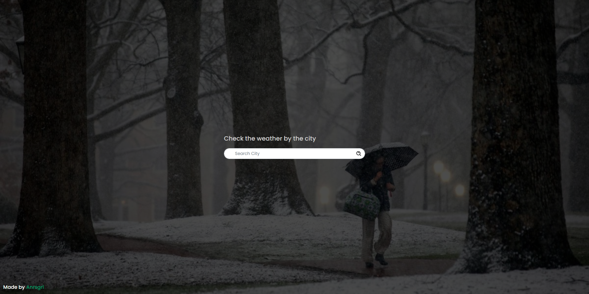
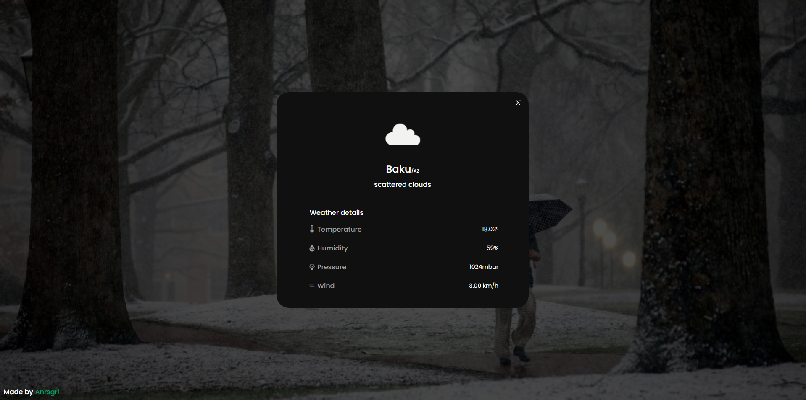

# Weather Forecast App⛅

The Weather Forecast App displays the current weather conditions of the desired city, making it easy for users to stay updated. With a simple and intuitive interface, users can quickly access detailed weather information including temperature, humidity, wind speed, and more. The app is designed to simplify weather tracking, ensuring users make informed decisions for their daily activities or travel plans


## Screenshots

[](https://weather-forecast-anrsgrl.netlify.app)
[](https://weather-forecast-anrsgrl.netlify.app)

## Tech Stack
- **JavaScript:** The primary programming language.
- **React:** Utilized for building the user interface.
- **Redux toolkit:** Employed for state management.
- **Bootstrap:** Styling and layout of components.
- **Framer Motion:** Integrated for animations.
- **Used api:** <a href="https://openweathermap.org/api"> OpenWeatherMap </a>


## Run Locally

Clone the project

```bash
  git clone https://github.com/Anrsgrl/ecommerce-furniture
```

Go to the project directory

```bash
  cd ecommerce-furniture
```

Install dependencies

```bash
  npm install
```

Start the server

```bash
  npm start
```


## Authors

- [Anrsgrl](https://www.github.com/Anrsgrl)
